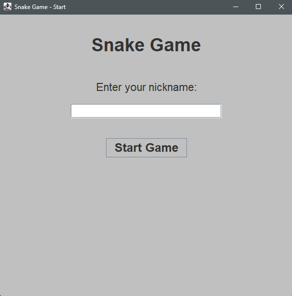
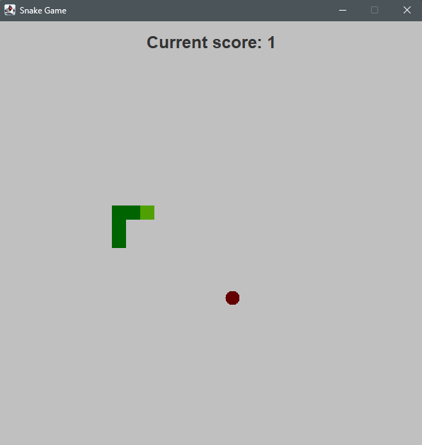
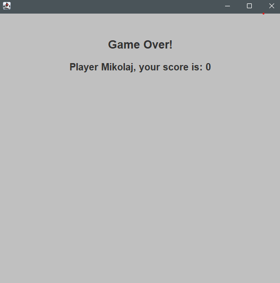

# 🐍 Snake Game - Java Swing

A simple but classic **Snake Game**, built using **Java Swing**.  
Move the snake, eat the food, grow longer, and try not to crash into walls or yourself!

## 🚀 Features
- Classic Snake gameplay
- Smooth keyboard controls (Arrow keys)
- Score counter displayed live
- Game Over screen when you crash
- Start screen with nickname input

## 🎮 Controls

| Key          | Action     |
|--------------|-------------|
| ⬆️ Up Arrow   | Move Up     |
| ⬇️ Down Arrow | Move Down   |
| ⬅️ Left Arrow | Move Left   |
| ➡️ Right Arrow| Move Right  |

## 🛠️ Built With
- Java (17+ recommended)
- Java Swing for GUI
- IDE: IntelliJ IDEA

## 🖼️ Preview

## 📦 How to Run

### 1. Clone the repository:
- git clone https://github.com/your_username/snake-game.git
### 2. Navigate into the project directory:
- cd snake-game
### 3.  Compile and run:
- javac src/**/*.java java logic.StartGameWindow

## 🧑‍💻 Author
- **msajewiczz** 
- [GitHub Profile](https://github.com/mSajewiczz)
